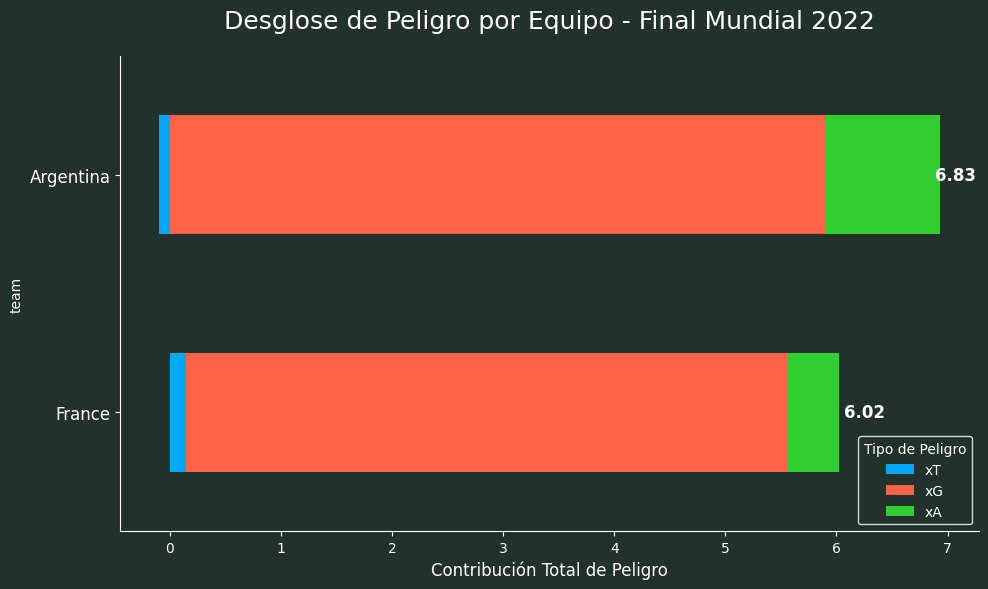

# Análisis de Peligro Esperado: Final de la Copa del Mundo 2022 - Argentina vs. Francia

## 🚀 Descripción del Proyecto

Este repositorio contiene un análisis detallado en formato Jupyter Notebook (Google Colab) de la final de la Copa del Mundo de la FIFA 2022 entre Argentina y Francia. El objetivo principal es cuantificar el "peligro" generado por cada equipo y sus jugadores utilizando métricas avanzadas de análisis de fútbol para responder a la hipótesis:

> **"¿Fue Argentina el justo vencedor de la final porque fue el equipo que generó más peligro total a lo largo del partido?"**

Para ello, se implementa un análisis multifacético que combina tres métricas clave:

1.  **Peligro Esperado (xT):** Evalúa el valor de progresar el balón a zonas más peligrosas del campo.
2.  **Goles Esperados (xG):** Mide la calidad y probabilidad de gol de cada oportunidad de tiro.
3.  **Asistencias Esperadas (xA):** Cuantifica el valor de los pases que terminan en un tiro.

El proyecto está diseñado de manera didáctica, explicando cada paso del proceso, desde la obtención de los datos hasta la visualización final de los resultados.

**[Haz clic aquí para abrir el análisis](Proyecto_DSII_PreEntrega_JuanCruzAlbornoz.ipynb)**

---

## 🛠️ Tecnologías y Librerías Utilizadas

Este análisis se basa en el ecosistema de Python para la ciencia de datos. Las principales herramientas son:

-   **Python 3:** Lenguaje de programación principal.
-   **Google Colab:** Entorno de desarrollo basado en la nube que permite ejecutar el notebook sin necesidad de instalaciones locales.
-   **Pandas:** Para la manipulación y análisis de datos tabulares.
-   **NumPy:** Para cálculos numéricos eficientes, especialmente en la manipulación de la matriz de xT.
-   **Matplotlib:** Para la creación de visualizaciones y gráficos.
-   **StatsBomb API (`statsbombpy`):** Para la obtención programática de datos de eventos de alta calidad y de libre acceso.
-   **mplsoccer:** Una librería especializada para dibujar canchas de fútbol y visualizaciones tácticas.

---

## 📂 Estructura del Análisis

El notebook está dividido en pasos lógicos y secuenciales para facilitar su comprensión:

1.  **Configuración del Entorno:** Instalación de las librerías necesarias.
2.  **Obtención de Datos:** Conexión a la API de StatsBomb para descargar todos los eventos de la final.
3.  **Análisis Exploratorio de Datos (EDA):** Un paso crucial para inspeccionar la estructura, calidad y contenido de los datos crudos.
4.  **Definición del Modelo xT:** Implementación de un grid de Peligro Esperado estándar para garantizar la reproducibilidad.
5.  **Cálculo de Métricas por Acción:** Procesamiento de los datos para calcular el `xt_added`, `xG` y `xA` de cada evento relevante.
6.  **Análisis por Jugador y por Equipo:** Agrupación de las métricas para identificar a los jugadores más influyentes en progresión (xT), finalización (xG) y creación (xA) y Síntesis de todas las métricas a nivel de equipo para responder a la hipótesis central del proyecto.
7.  **Visualización de Resultados:** Creación de gráficos de barras claros y con un diseño cuidado para comunicar los hallazgos de forma efectiva.

---

## 📈 Conclusión Principal del Análisis

Los resultados del análisis respaldan la hipótesis. Aunque Francia fue extremadamente eficaz en la finalización (alto xG), **Argentina generó un mayor "Peligro Total" (6.83 vs 6.02)** al dominar en las métricas de progresión y creación de juego (xT y xA).

El análisis revela que, más allá del resultado final, el rendimiento ofensivo de Argentina fue más completo y sostenido a lo largo del partido.

---

## 📖 Cómo Ejecutar este Proyecto

1.  **Abre el Notebook:** Haz clic en el enlace "Open In Colab" que se encuentra en la parte superior.
2.  **Crea una Copia:** Para poder ejecutar y modificar el código, ve a `Archivo > Guardar una copia en Drive`. Esto creará una copia personal en tu propia cuenta de Google Drive.
3.  **Ejecuta las Celdas:** Ejecuta cada celda de código en orden, desde la parte superior hasta la inferior, haciendo clic en el botón de "Play" (▶️) de cada celda.
